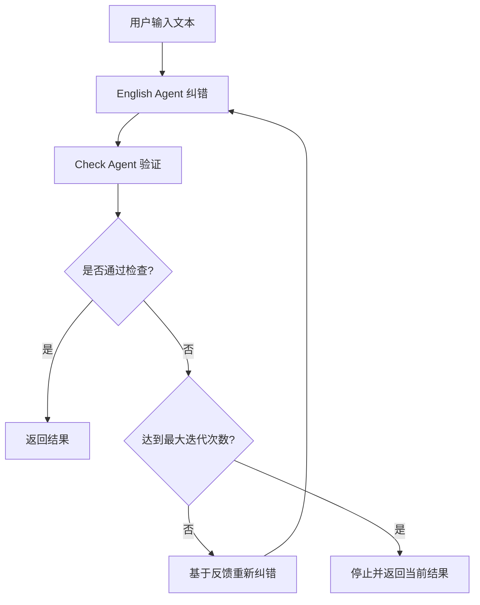

# LangGraph英语纠错系统

基于LangGraph框架重构的英语语法纠错系统，采用双代理循环验证机制。

## 🏗️ 系统架构

### 核心组件

1. **English Agent (英语纠错代理)**
   - 负责根据严格的标记规则纠正英文文本
   - 使用三种标记类型：`[correction]`、`<correction>`、`{correction}`
   - 支持基于反馈的迭代改进

2. **Check Agent (检查代理)**
   - 验证纠错结果是否符合标记规则要求
   - 检查语法准确性和规则合规性
   - 提供详细的反馈信息

3. **循环控制机制**
   - 自动循环直到检查通过或达到最大迭代次数
   - 防止无限循环的安全机制
   - 状态管理和进度跟踪

### 工作流程



## 🚀 快速开始

### 环境配置

1. 创建 `.env` 文件：
```bash
cp .env.example .env
```

2. 配置环境变量：
```env
MODEL_NAME="gpt-4"
OPENAI_API_KEY="your_api_key_here"
MODEL_BASE_URL="https://api.openai.com/v1"
```

### 安装依赖

```bash
pip install langchain-openai langgraph python-dotenv
```

### 运行系统

#### 1. 演示模式
```bash
python demo_langgraph.py
```

#### 2. 直接使用
```bash
python new_EnglishAgent.py
```

#### 3. 编程接口
```python
from new_EnglishAgent import process_text

result = process_text("what is you're name.")
print(result)
```

## 📋 标记规则

### 三种标记类型

1. **`[correction]` - 单词替换**
   - 用于单个词汇的纠正
   - 例：`freind[friend]`、`dont[don't]`

2. **`<correction>` - 标点符号**
   - 用于标点符号的添加或修正
   - 例：`<.>`、`<,>`、`<?>`

3. **`{correction}` - 句子重构**
   - 用于完整句子的重新构建
   - 例：`{Having finished the assignment, I turned on the TV.}`

### 规则要点

- `[]` 内只能有一个单词
- `<>` 只用于标点符号修正
- `{}` 包含完整正确句子，内部不使用 `<>` 标记
- 无错误时输出：`✅ No errors found.`

## 🔧 系统特性

### 优势

1. **双代理验证**：确保纠错结果的准确性和规则合规性
2. **循环改进**：基于反馈持续优化纠错结果
3. **安全机制**：防止无限循环的最大迭代次数限制
4. **状态管理**：完整的处理状态跟踪和历史记录
5. **模块化设计**：易于扩展和维护

### 配置参数

- **最大迭代次数**：默认5次，可在代码中调整
- **模型选择**：支持任何OpenAI兼容的API
- **详细日志**：完整的处理过程记录

## 📊 使用示例

### 输入示例
```
what is you're name.
```

### 处理过程
1. **English Agent**: `what[What] is you're[your] name<?>`
2. **Check Agent**: 验证标记规则和语法准确性
3. **结果**: 通过检查或基于反馈重新处理

### 输出结果
```json
{
    "original_text": "what is you're name.",
    "corrected_text": "what[What] is you're[your] name<?>",
    "check_result": "APPROVED: The correction follows all rules correctly.",
    "iterations": 1,
    "approved": true
}
```

## 🛠️ 自定义和扩展

### 修改提示词
在 `new_EnglishAgent.py` 中修改 `instructions` 变量来调整纠错规则。

### 调整检查标准
修改 `check_agent` 函数中的检查逻辑来改变验证标准。

### 扩展功能
- 添加更多代理节点
- 实现不同的路由逻辑
- 集成外部工具和API

## 🐛 故障排除

### 常见问题

1. **环境变量未设置**
   - 确保 `.env` 文件存在且配置正确

2. **API调用失败**
   - 检查API密钥和基础URL
   - 确认网络连接正常

3. **无限循环**
   - 系统有最大迭代次数限制
   - 检查提示词是否过于严格

### 调试技巧

- 启用详细日志输出
- 检查每次迭代的状态变化
- 验证API响应格式

## 📈 性能优化

- 使用更快的模型减少延迟
- 调整最大迭代次数平衡质量和速度
- 实现结果缓存机制

## 🤝 贡献

欢迎提交问题报告和功能请求！

## 📄 许可证

MIT License