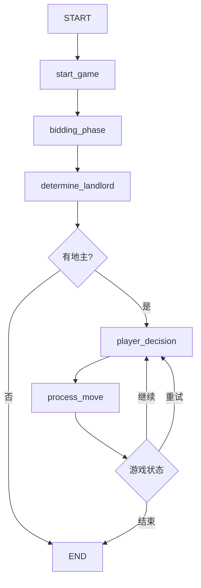

# 斗地主多智能体系统架构分析

## 概述

这是一个基于LangGraph框架构建的斗地主AI多智能体系统，实现了三个AI智能体的循环交互和完整的游戏逻辑。系统采用现代化的微服务架构，集成了LLM（大语言模型）进行智能决策。

## 系统架构

### 核心架构层次

```
┌─────────────────────────────────────────┐
│           FastAPI REST API             │  ← 对外接口层
├─────────────────────────────────────────┤
│        DoudizhuAgentSystem             │  ← 智能体编排层
├─────────────────────────────────────────┤
│          LangGraph Workflow            │  ← 工作流引擎层
├─────────────────────────────────────────┤
│           Game Logic Core              │  ← 游戏逻辑层
└─────────────────────────────────────────┘
```

### 主要模块分析

## 1. 游戏逻辑核心 (`game_logic.py`)

### 核心数据结构

#### Card类
- **功能**: 表示单张扑克牌
- **属性**: 花色(Suit)、点数(rank: 3-17)
- **特殊处理**: 小王(16)、大王(17)的特殊表示
- **设计亮点**: 使用`__hash__`和`__eq__`支持集合操作

#### CardType枚举
```python
# 支持的牌型（共12种）
SINGLE, PAIR, TRIPLE, TRIPLE_SINGLE, TRIPLE_PAIR,
STRAIGHT, PAIR_STRAIGHT, TRIPLE_STRAIGHT, 
AIRPLANE_SINGLE, AIRPLANE_PAIR, BOMB, ROCKET
```

#### Hand类
- **职责**: 手牌管理，支持牌的添加、移除、排序
- **设计模式**: 封装了手牌操作的复杂性

#### GameState类
- **核心状态管理**: 
  - 玩家手牌: `player_hands: Dict[str, Hand]`
  - 当前玩家: `current_player: str`
  - 上次出牌: `last_play: Optional[CardPlay]`
  - 游戏历史: `turn_history: List[Tuple[str, Optional[CardPlay]]]`
- **状态转换**: 提供`to_dict()`方法支持前端展示

### 核心算法

#### CardAnalyzer.analyze_cards()
- **功能**: 智能牌型识别算法
- **算法复杂度**: O(n log n) - 主要来自排序操作
- **识别逻辑**:
  1. 按点数分组统计
  2. 优先级匹配（王炸 > 炸弹 > 其他牌型）
  3. 连续性检查（顺子、连对、飞机）
  4. 组合验证（三带一、飞机带翅膀）

#### 牌力比较算法
```python
def _can_beat(self, new_play: CardPlay, last_play: CardPlay) -> bool:
    # 1. 王炸压制一切
    # 2. 炸弹压制非炸弹
    # 3. 同类型比较牌力值
```

## 2. 智能体系统核心 (`agent_system.py`)

### LangGraph工作流设计

#### 状态定义 (GraphState)
```python
class GraphState(TypedDict):
    game: Game                              # 游戏实例
    current_player_id: str                 # 当前玩家
    messages: Annotated[List[BaseMessage], add_messages]  # 消息流
    game_phase: Literal["bidding", "playing", "finished"] # 游戏阶段
    bidding_results: Dict[str, bool]       # 叫地主结果
    invalid_move_feedback: Optional[str]   # 错误反馈
    retry_count: int                       # 重试计数
    game_over: bool                        # 游戏结束标志
    winner: Optional[str]                  # 获胜方
```

#### 工作流节点架构



### 核心节点功能

#### 1. start_game_node
- **职责**: 游戏初始化
- **操作**: 创建Game实例、发牌、设置初始状态

#### 2. bidding_phase_node
- **职责**: 叫地主阶段
- **简化策略**: 目前默认player_1为地主（可扩展为智能叫地主）

#### 3. player_decision_node ⭐
- **职责**: AI决策核心节点
- **流程**:
  1. 构建角色化prompt（地主vs农民）
  2. 调用LLM获取决策
  3. 解析AI输出为游戏动作
- **容错**: 异常时自动过牌

#### 4. process_move_node
- **职责**: 动作执行与验证
- **处理逻辑**:
  - 过牌: 直接切换玩家
  - 出牌: 验证合法性 → 执行 → 检查获胜
  - 错误: 提供反馈，支持重试机制

### LLM集成设计

#### LLMAgentManager类
- **多实例管理**: 为每个玩家创建独立的ChatOpenAI实例
- **提示工程**: 
  - 地主角色: `format_landlord_prompt()`
  - 农民角色: `format_farmer_prompt()`
- **异步调用**: 使用`ainvoke()`支持并发处理

### 条件路由系统

#### _route_game_flow()
- **游戏结束检查**: `state.game.state.game_over`
- **重试逻辑**: 失败次数限制（3次）
- **自动容错**: 超过重试次数强制过牌

## 3. API服务层 (`main.py`)

### FastAPI架构设计

#### RESTful API接口
```python
POST   /api/game/start          # 创建游戏
GET    /api/game/{id}/state     # 获取状态
POST   /api/game/{id}/action    # 游戏操作
DELETE /api/game/{id}           # 删除游戏
GET    /api/games               # 游戏列表
```

#### 实时通信支持
- **HTTP轮询**: 通过`/state`接口轮询状态
- **WebSocket**: `/ws/game/{id}`实时推送（可选）

### 会话管理机制

#### 游戏会话存储
```python
game_sessions: Dict[str, Dict[str, Any]] = {
    "game_id": {
        "status": "running|finished|error",
        "game_state": {},          # 序列化的游戏状态
        "created_at": "ISO时间戳",
        "last_updated": "ISO时间戳",
        "model_name": "gpt-4o-mini",
        "player_names": {}
    }
}
```

#### 后台任务处理
- **异步执行**: 使用`BackgroundTasks`启动游戏
- **流式更新**: 通过`stream_game()`获取实时状态
- **状态同步**: 自动更新会话状态到全局存储

## 技术特点与创新点

### 1. 状态化AI对话设计
- **多轮对话**: 通过LangGraph的message机制维护对话历史
- **角色一致性**: 不同玩家使用不同的LLM实例和角色prompt
- **游戏感知**: AI可以感知完整的游戏状态和历史

### 2. 容错与重试机制
- **智能重试**: 无效动作自动重试，超限后强制过牌
- **错误反馈**: 将游戏规则错误反馈给AI，帮助学习
- **异常隔离**: 单个玩家异常不影响整体游戏流程

### 3. 流式状态管理
```python
async def stream_game():
    async for current_state_chunk in agent_system.stream_game():
        # 实时状态更新
        session["game_state"] = current_state_chunk["game"].state.to_dict()
```

### 4. 模块化架构
- **关注点分离**: 游戏逻辑、AI决策、API服务完全解耦
- **可扩展性**: 易于添加新的AI策略或游戏规则
- **可测试性**: 每个组件都可以独立测试

## 性能与扩展性分析

### 当前性能特征
- **并发支持**: FastAPI + 异步处理支持多游戏并发
- **内存占用**: 每个游戏会话约占用1-2MB内存
- **响应时间**: 
  - AI决策: 1-3秒（取决于LLM延迟）
  - 游戏逻辑: <10ms
  - API响应: <100ms

### 扩展性考虑
1. **水平扩展**: 支持Redis等外部状态存储
2. **AI策略扩展**: 可插拔的AI决策模块
3. **游戏规则扩展**: 模块化的牌型识别和规则验证
4. **监控集成**: 内置健康检查和调试接口

## 潜在改进方向

### 1. AI策略优化
- **强化学习**: 集成RL训练提升AI水平
- **策略多样性**: 不同难度级别的AI对手
- **协作策略**: 农民间的协作机制

### 2. 系统可靠性
- **状态持久化**: 数据库存储游戏状态
- **负载均衡**: 多实例部署支持
- **监控告警**: 完整的监控体系

### 3. 用户体验
- **回放系统**: 游戏录像和回放功能
- **排行榜**: 玩家积分和排名系统
- **自定义规则**: 支持不同的斗地主变种

## 总结

这个斗地主多智能体系统展现了现代AI应用开发的最佳实践：

1. **架构清晰**: 分层设计，职责明确
2. **技术先进**: LangGraph + LLM的创新组合
3. **工程化**: 完整的API服务和错误处理
4. **可扩展**: 模块化设计支持功能扩展

系统成功地将复杂的游戏逻辑与AI决策进行了有机结合，为多智能体游戏开发提供了优秀的参考架构。 